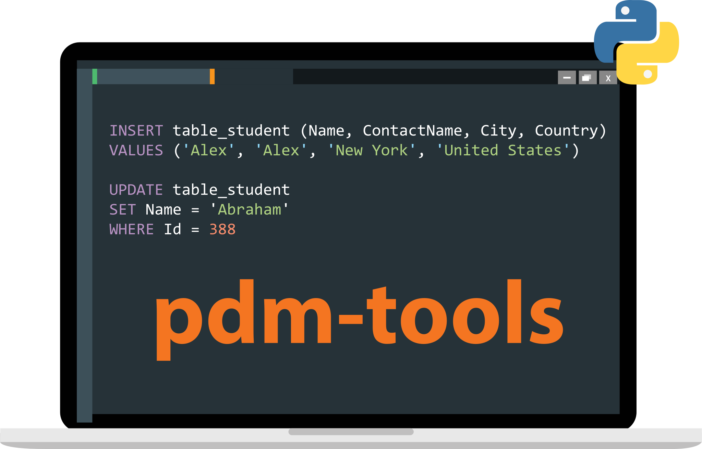

# PDM Tools

<center></center><br>

This is a simple tool package for querying data from 
[Production Data Mart](https://wiki.equinor.com/wiki/index.php/Production_Data_Mart) without having to re-authenticate every time. <br>

Pull requests, feature requests and issues are welcome to be filed through the 
[GitHub Project Repository](https://github.com/equinor/pdm-tools) or as a ServiceNow ticket 
directed to Production Data Mart.

## Usage
1. From the python environment you want to install the package in, run:<br>
    ```pip install git+https://github.com/equinor/pdm-tools.git``` <br>
2. The [ODBC Driver for SQL Server](https://learn.microsoft.com/en-us/sql/connect/odbc/download-odbc-driver-for-sql-server) must be installed. <br>
3. To query PDM and retrieve data:<br>
    ```
    import datetime as dt

    from pdm_tools import tools

    sql = 'SELECT TOP(1) * FROM PDMVW.WELL_PROD_DAY'
    df = tools.query(sql)
    print(df)

    # Use parameter bindings to avoid SQL injection issues.
    sql = "SELECT top(100) * FROM PDMVW.WELL_PROD_DAY WHERE COUNTRY = :countrycode AND PROD_DAY = :startdate"
    df = tools.query(sql, params={'countrycode': 'NO',
                     'startdate': dt.datetime(2022, 1, 1)})
    print(df)
    ```
   
## Legacy
If you wish to use an older version of this package, this can be done by passing a parameter with the pip-command, e.g.: <br>
    ````
    pip install git+https://github.com/equinor/pdm-tools.git@v1.0
    ````

