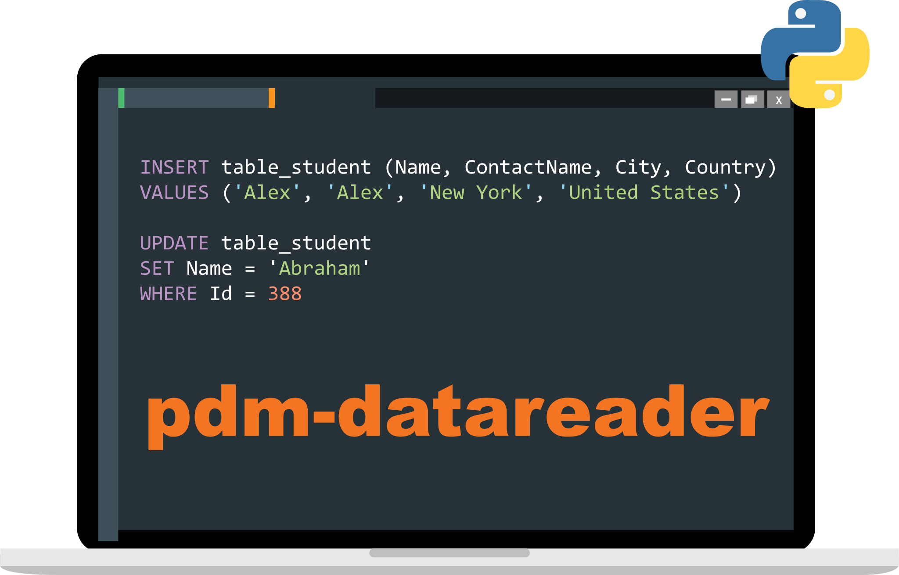

# PDM Reader

<p align="center">

</p>

[](https://img.shields.io/badge/Windows-0078D6?style=for-the-badge&logo=windows&logoColor=white)
[](https://img.shields.io/badge/mac%20os-000000?style=for-the-badge&logo=apple&logoColor=white)
[](https://img.shields.io/badge/Red%20Hat-EE0000?style=for-the-badge&logo=redhat&logoColor=white)
[](https://scm-compliance-api.radix.equinor.com/repos/equinor/neqsim/badge)

`pdm-datareader` is a python package for querying [Production Data Mart](https://wiki.equinor.com/wiki/index.php/Production_Data_Mart) tables using SQL. The package handles authentication for end users with user impersonation, but also allows for inserting your own token. It must be run from Equinor managed environments connected to Equinor network.

Pull requests, feature requests and issues are welcomed using the [GitHub Project Repository](https://github.com/equinor/pdm-datareader) or as a ServiceNow ticket directed to Production Data Mart.

## Install
1. Ensure that [ODBC Driver for SQL Server](https://learn.microsoft.com/en-us/sql/connect/odbc/download-odbc-driver-for-sql-server) is installed. Currently supports both v18 and v17.  
This driver is bundled with the [Microsoft SQL Client](https://accessit.equinor.com/Search/Search?term=MICROSOFT+SQL+CLIENT) package in AccessIT, and should be pre installed on linux environments. Instructions for installing on MacOS can be found [here.](https://learn.microsoft.com/en-us/sql/connect/odbc/download-odbc-driver-for-sql-server).
2. MacOS users must install unixodbc. See [https://pypi.org/project/pyodbc/](https://pypi.org/project/pyodbc/) for current instructions.
3. Linux users must apply for [Linux compliant device exclusion](https://accessit.equinor.com/Search/Search?term=linux+exclusion) to get multifactor authentication to work.
4. Finally install the latest version of the python package using:  
    ```pip install pdm-datareader```

## Usage
See [examples/demo.py](examples/demo.py) or try the code below that queries PDM and retrieves data:  

``` python
import datetime as dt
from pdm_datareader import tools

# Example with parameter bindings to avoid SQL injection issues (recommended)
sql = '''
SELECT top(100) * 
FROM PDMVW.WELL_PROD_DAY 
WHERE COUNTRY = :countrycode 
AND PROD_DAY = :startdate"
'''
df = tools.query(sql, params={'countrycode': 'NO',
                 'startdate': dt.datetime(2022, 1, 1)})
print(df)

# Example without parameters (not recommended)
sql = 'SELECT TOP(1) * FROM PDMVW.WELL_PROD_DAY'
df = tools.query(sql)
print(df)
```